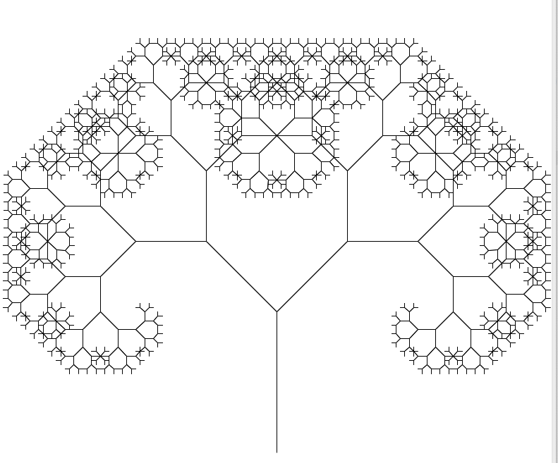

## task01 ##
### subtaskA ###

**reverse**

- Список інвертується за один прохід (лінійний час O(n)).

- Використовується константна додаткова пам'ять O(1) (не потрібно допоміжних структур даних).

### subtaskB ###

- Source list:
6 -> 8 -> 9 -> 7 -> 10 -> 5 -> 3 -> 1 -> 2 -> 4 -> None

**insertion sort**

- After insertion sort:
1 -> 2 -> 3 -> 4 -> 5 -> 6 -> 7 -> 8 -> 9 -> 10 -> None

**merge sort**

- After merge sort:
1 -> 2 -> 3 -> 4 -> 5 -> 6 -> 7 -> 8 -> 9 -> 10 -> None

Сортування злиттям ефективніше для довгих списків завдяки логарифмічній складності ділення і лінійному злиттю.

## task02 ##
#### Pythagoras tree fractal ####
recursion level = 11
