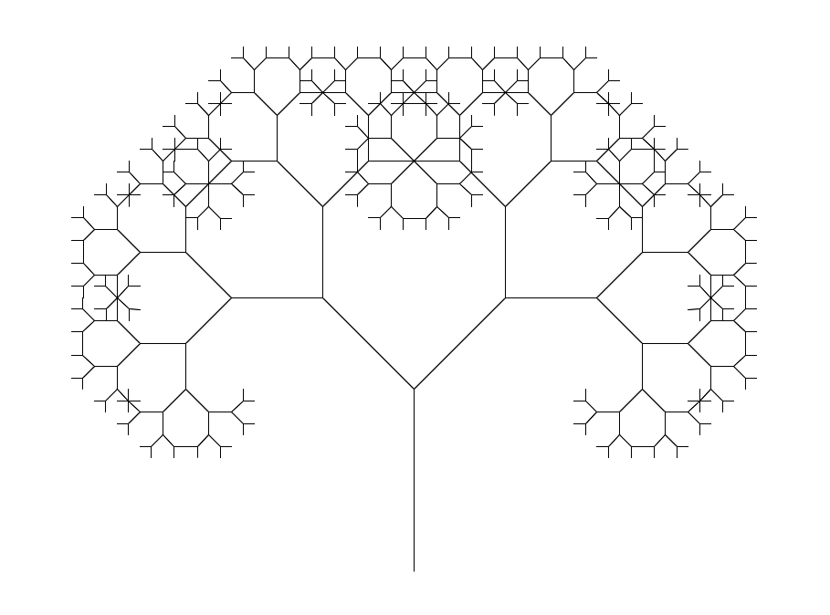

## task01 ##
### subtaskA ###

**reverse**

- Список інвертується за один прохід (лінійний час O(n)).

- Використовується константна додаткова пам'ять O(1) (не потрібно допоміжних структур даних).

### subtaskB ###

- Source list:
6 -> 8 -> 9 -> 7 -> 10 -> 5 -> 3 -> 1 -> 2 -> 4 -> None

**insertion sort**

- After insertion sort:
1 -> 2 -> 3 -> 4 -> 5 -> 6 -> 7 -> 8 -> 9 -> 10 -> None

**merge sort**

- After merge sort:
1 -> 2 -> 3 -> 4 -> 5 -> 6 -> 7 -> 8 -> 9 -> 10 -> None

Сортування злиттям ефективніше для довгих списків завдяки логарифмічній складності ділення і лінійному злиттю.

## task02 ##
#### Pythagoras tree fractal ####
recursion level = 9

## task04 ##
### Аналіз коду ###
**Імпорт бібліотек**

- `uuid`: Використовується для генерації унікальних ідентифікаторів для кожного вузла дерева.
- `networkx`: Бібліотека для роботи з графами. У цьому випадку використовується для створення та візуалізації дерева.
- `matplotlib.pyplot`: Бібліотека для візуалізації даних. Використовується для відтворення дерева.

**Клас Node**
- Клас `Node` представляє вузол бінарного дерева.
- `key`: Значення вузла.
- `color`: Колір вузла, який буде використовуватися під час візуалізації (за замовчуванням «skyblue»).
- `id`: Унікальний ідентифікатор вузла, що генерується за допомогою `uuid.uuid4()`.

**Функція `add_edges`**
- Функція `add_edges` рекурсивно додає вузли та ребра в граф, починаючи з кореневого вузла.
- `graph`: Об'єкт графа, до якого додаються вузли та ребра.
- `node`: Поточний вузол дерева.
- `pos`: Словник, який зберігає позиції вузлів для візуалізації.
- `x, y`: Координати поточного вузла.
- `layer`: Рівень вкладеності вузла (використовується для розрахунку координат).

**Функція `draw_tree`**
- Функція `draw_tree` створює граф, додає в нього вузли та ребра, а потім візуалізує дерево.
- `tree_root`: Кореневий вузол дерева.
- `tree`: Спрямований граф, який буде використовуватися для візуалізації.
- `pos`: Словник, що зберігає позиції вузлів.
- `colors`: Список кольорів вузлів.
- `labels`: Словник міток вузлів.

## task07 ##
#### Очікуваний результат ####
Таблиця показує, що результати симуляції близькі до теоретичних значень, але є невеликі відхилення
через випадковість методу Монте-Карло.